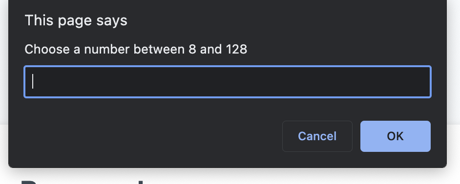

# Password Generator

## Description

Provide a short description explaining the what, why, and how of your project. Use the following questions as a guide:

- My motivation with this project was to create an efficient and dynamic password generator.
- After learning javascript, I built this project to test my knowledge of javascript and general coding principles.
- This problem completes a website that offers users a way to generate a password to their liking without giving it too much thought.
- I unfortunatly was reminded of block scope and had the think around that. The biggest thing that came to mind, was that I don't have to compare values, instead compare properties. 

## Table of Contents (Optional)

- [Description](#description)
- [Usage](#usage)
- [Credits](#credits)
- [License](#license)
- [How-to-Contribute](#how-to-contribute)
- [Tests](#tests)

## Usage

To use this password-generator, access the html file by opening it locally, live, or go to live website. 

You should come across a home page that looks like this. 

Now you can press the button to generate password. You will be first prompted with: 

If you fail to provide a vaild number. Then you will get a try again, and have to start all over. 

After succesfully providing a number, the next prompt with ask whether you want lowercase:

Next will be uppercase: 

Following will be numbers:

Lastly, will be special characters:

If you fail to confirm at least one of the confirmation of character types, you will get a try again and have to start all over. 

After successfully completing all the steps, you should be provided with a generated password for you to use. 

The entire flow is complete, you may generate as many passwords as you need. 

## Credits

1. https://www.w3schools.com/js/js_strings.asp
- For a reminder on how to use an escape character on a backslash

2. https://www.w3schools.com/jsref/jsref_join.asp
- Needed to know how to convert an array to a string

## License

MIT License

Copyright (c) 2023 javieb5186

Permission is hereby granted, free of charge, to any person obtaining a copy
of this software and associated documentation files (the "Software"), to deal
in the Software without restriction, including without limitation the rights
to use, copy, modify, merge, publish, distribute, sublicense, and/or sell
copies of the Software, and to permit persons to whom the Software is
furnished to do so, subject to the following conditions:

The above copyright notice and this permission notice shall be included in all
copies or substantial portions of the Software.

THE SOFTWARE IS PROVIDED "AS IS", WITHOUT WARRANTY OF ANY KIND, EXPRESS OR
IMPLIED, INCLUDING BUT NOT LIMITED TO THE WARRANTIES OF MERCHANTABILITY,
FITNESS FOR A PARTICULAR PURPOSE AND NONINFRINGEMENT. IN NO EVENT SHALL THE
AUTHORS OR COPYRIGHT HOLDERS BE LIABLE FOR ANY CLAIM, DAMAGES OR OTHER
LIABILITY, WHETHER IN AN ACTION OF CONTRACT, TORT OR OTHERWISE, ARISING FROM,
OUT OF OR IN CONNECTION WITH THE SOFTWARE OR THE USE OR OTHER DEALINGS IN THE
SOFTWARE.

## How to Contribute

You could contribute this by adding more features or secure passwords. 

## Tests

Try and produce an error that I can replicate. See what happens when you type a word in the number prompt. See what happenns when you 
don't answer yes to any of the yes or no confirmations. 